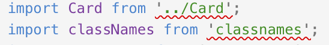

## Eslint and Prettier


<!-- .element style="border: 0; background: None; box-shadow: None" -->

by Karolis

> © Images are taken from Google, for no commercial use only :)

---

## Structure

* why do I talk about it?
* eslint
  * why should one use it?
  * setup
  * @ Wix
* prettier
  * why should one use it?
  * setup

> Questions on the go

---

## Why am I wasting your time with this talk?


<!-- .element style="border: 0; background: None; box-shadow: None" -->

--

### Work as play


<!-- .element style="border: 0; background: None; box-shadow: None; height: 250px" -->


--

#### Feedback loop

_example numbers for scale_

* eslint - type code, save file, wait for imports resolution => **3s**
* prettier - execute command, wait to complete => **3s**
* unit tests - save, target (only), wait for suite start & test run => **12s**
* manual debugging - save, wait for rebuild, wait for reload, excercise scenario => **55s**
* e2e tests - save, build, start test environment, wait for tests, debug failures => **230s**

--

#### Immediate feedback


---


<!-- .element style="border: 0; background: None; box-shadow: None" -->

--

### Why should one waste time settin it up?


<!-- .element style="border: 0; background: None; box-shadow: None" -->

---

#### Which is better?


<!-- .element style="border: 0; background: None; box-shadow: None" -->

--

```js
// function vs const?
const searchContent = (instanceId, text) =>
  contentStorage.search(
    // how many params to allow for a function?
    ["description", "title"], // single or double quotes?
    text,
    { author: 'John' } // spacing for curly braces
  ); // semicolons?
```

--

```js
<Element
  className={classNames(styles.header, contentFontClassName)}
  // isVisible ?
  isVisible={true}
/> // aligned with last prop?
```

--

```js
import flowRight from 'lodash/flowRight';
import {flowRight} from 'lodash';
import _ from 'lodash';
```

--

(╯°□°)╯︵ ┻━┻

> muscle memory

---

#### How do I make sure my code satisfies basic clean code requirements?

Let's look at some [code examples](./src/client/eslint-examples).

--

We can warn/error on these...

```js
console.log('use wrapper instead')
debugger
it.only()
```

---

#### Moving files around - make sure paths are valid!


<!-- .element style="border: 0; background: None; box-shadow: None" -->

--

##### Client side

[eslint-plugin-import](https://www.npmjs.com/package/eslint-plugin-import)

Detects invalid imports:

* desctructuring
* default imports
* paths

--

##### Server side

[eslint-plugin-node](https://www.npmjs.com/package/eslint-plugin-node)

Detects:

* invalid require paths
  * only paths!
* unsupported/deprecated features
  * requires node version to detect those
    * `"parserOptions": { "ecmaVersion": 8 }` in _.eslintrc_
    * `"engines": { "node": ">=8" }` in _package.json_

---

### At Wix


<!-- .element style="border: 0; background: None; box-shadow: None" -->

--

[eslint-config-wix](https://www.npmjs.com/package/eslint-config-wix) is included in yoshi.
Let's take a look at the
[source code](https://github.com/wix/eslint-config-wix/blob/master/index.js).

--

Yoshi from 2.0 uses **eslint v4** instead of **eslint v3**.

##### How do I fix all those silly spacing errors?

```sh
npx eslint . --fix-dry-run
npx eslint src/client --fix

## does not support multiple dirs with single command :(
npx eslint --help
eslint [options] file.js [file.js] [dir]
```

--

##### issue with warnings!

---

### How to add eslint to an existing project?

--

Install to devDependencies

```
npm i -D eslint eslint-config-wix babel-eslint eslint-plugin-import eslint-plugin-node
```

Setup your editor for fast feedback loop and autofix.

Add lint command to `package.json`

```json
"scripts": {
  "lint:yoshi": "yoshi lint",
  "lint:eslint": "eslint . --ext *.js",
  "lint:eslint-fix": "eslint . --ext *.js --fix",
}
```

--

Create configurations hierarchy

```
root
  .eslintrc
  src
    client
      .eslintrc
    common
      .eslintrc
    server
      .eslintrc
  test
    .eslintrc
```

--

Disable rules that you don't want to fix now. `--fix-dry-run` is your friend here.

Ignore files that should not be linted -
[manual-ignore](./src/common/manual-ignore.js) or [eslintignore](./src/common/copy-pasted.js)

--

Configure conditional prepush hooks - not everybody wants to run those in case of monorepo:

```
(cd "repository-name"
npm run -s prepush || {
  echo
  echo "pre-push hook failed (add --no-verify to bypass)"
  exit 1
})
```

--

Make a PR for eslint config - don't update all the sources yet.

Ensure that everybody has merged their code.
Run eslint with `--fix` flag.
Fix all not autofixable errors.
Make a PR, make sure everybody agrees that you have enabled rules they can follow.

--

Enable in CI - add to `test` script in `package.json`

```json
"scripts": {
  "lint": "yoshi lint",
  "test:client": "mocha ./src/**/*.spec.js",
  "test:server": "mocha ./test/**/*.spec.js",
  "test:e2e": "haste test --protractor",
  "test": "npm run lint && npm run test:client && npm run test:server && npm run test:e2e",
}
```

--


<!-- .element style="border: 0; background: None; box-shadow: None" -->

---


<!-- .element style="border: 0; background: None; box-shadow: None" -->

--


<!-- .element style="border: 0; background: None; box-shadow: None" -->

This is **controversional**, ESLINT IS A MUST, prettier is debatable.

--

### Why should one waste time settin it up?


<!-- .element style="border: 0; background: None; box-shadow: None" -->

--

Why should one waste time formatting the code?


<!-- .element style="border: 0; background: None; box-shadow: None" -->

--

Let's talk...

> [Go fmt](https://blog.golang.org/go-fmt-your-code)

> letting go your pretious formatting

> change of flow

--

### Code examples

Let's take a look at the [code examples](./src/client/prettier-examples).

--

### Configurations

* Let prettier decide how code should be formatted
* Let prettier decide how code should be formatted and add eslint rules on the top

--

##### Automatic

* [eslint-plugin-prettier](https://github.com/prettier/eslint-plugin-prettier)
  * runs Prettier as an ESLint rule and reports differences as individual ESLint issues
* [eslint-config-prettier](https://github.com/prettier/eslint-config-prettier)
  * turns off all rules that are unnecessary or might conflict with Prettier

```json
"scripts": {
  "prettify": "prettier --write",
  "prettify:src": "npm run prettify \"./src/**/*.js\"",
}
```

--

##### Controlled

* [prettier-eslint](https://github.com/prettier/prettier-eslint)
  * Code ➡️ prettier ➡️ eslint --fix ➡️ Formatted Code
* [prettier-eslint-cli](https://github.com/prettier/prettier-eslint-cli)
  * CLI for prettier-eslint to apply prettier for folders instead of files

```json
"scripts": {
  "prettify": "prettier-eslint --write",
  "prettify:src": "npm run prettify \"./src/**/*.js\"",
}
```

---

### Adding to project

Install packages, setup scripts, commit, prettify project, make a PR, agree on formatting, add ignores, success.

---

## Questions?


<!-- .element style="border: 0; background: None; box-shadow: None" -->

Hope you had fun :)
