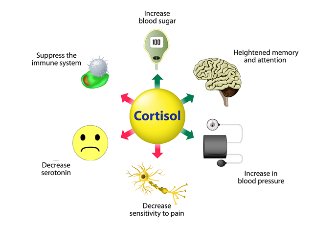
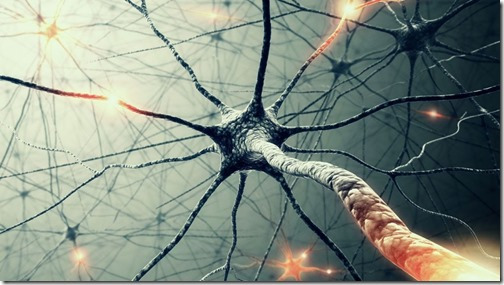

# Configure your brain! Learn patterns of how your brain functions

[Inspired by Christopher Bergland article](https://www.psychologytoday.com/us/blog/the-athletes-way/201402/chronic-stress-can-damage-brain-structure-and-connectivity)

---

## Structure

- Stress effect on your brain
- Forming habits
- Changing reactions
- Meditation as a way to break thoughts cycle

---

## Stress effect on your brain

[Video](https://www.youtube.com/watch?v=WuyPuH9ojCE),
[Alt video](videos/stress-effects.mp4)

--

### Short term stress

* improves focus and releases energy
* supresses digestion and immune systems

--

### Chronic stress

Response to emotional pressure suffered for a prolonged period of time

* overworked
* unrealistic deadlines
* multitasking
* arguments at home

--

### Chronic stress effects

* stronger amygdala - more fear
* weaker hypocampus - less learning and memory
* shrinking of prefrontal cortex - less cognitive ability
  * loss of synaptic connections between neurons

---

## Synaptic connections

[Video](https://www.youtube.com/watch?v=mItV4rC57kM),
[Alt video](videos/synapses.mp4)

* neurons 1 or 0
* synapses 
  * sender signal 0..1 
  * receiver sensitivity 0..1 

Brain activity - stable patterns of neuron firing.

--

### Neuroplasticity

[Video](https://www.youtube.com/watch?v=1EQ3kAPzVVI)
[Alt video](videos/neuroplasticity.mp4)